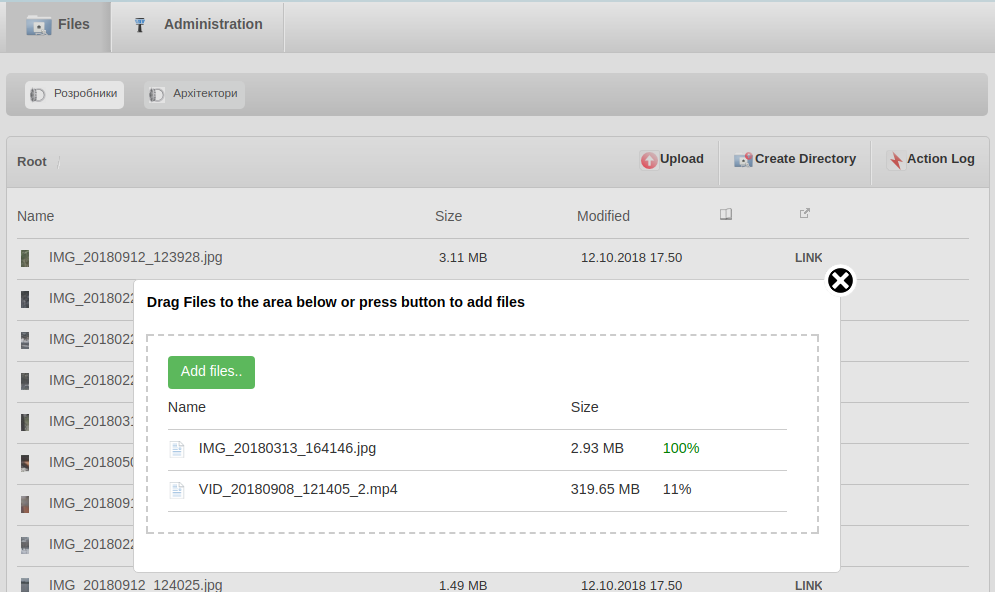
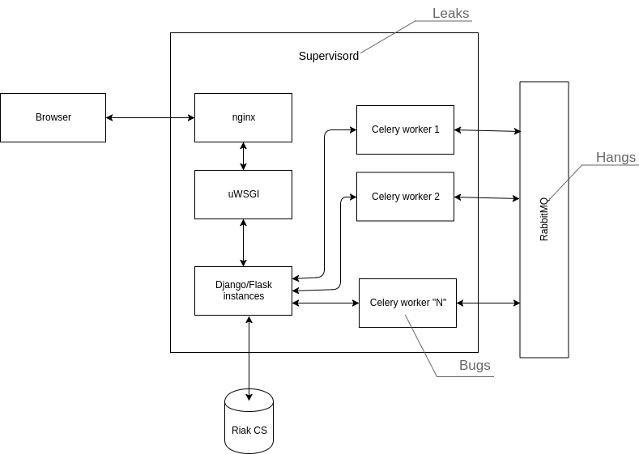
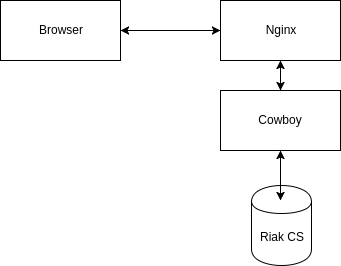
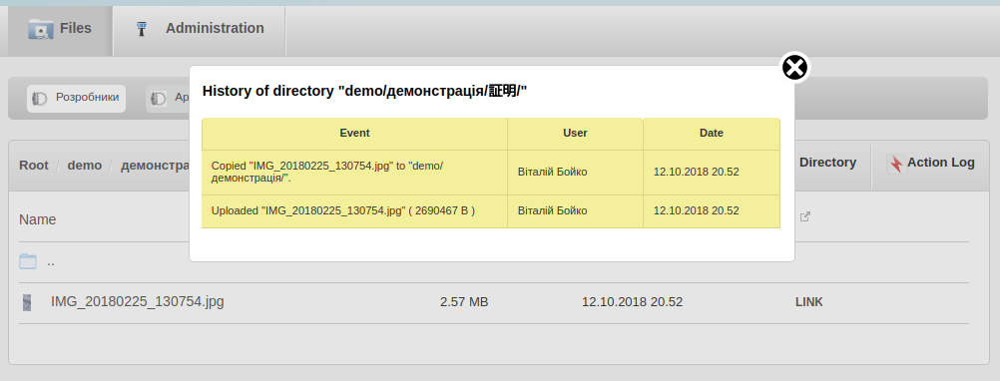
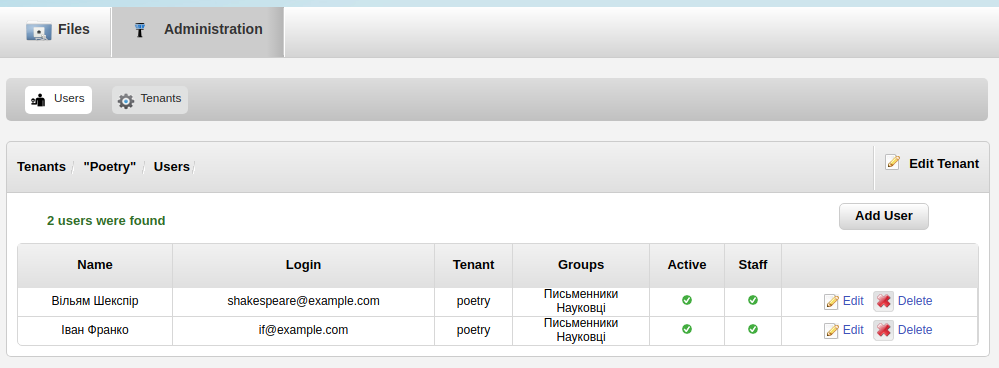
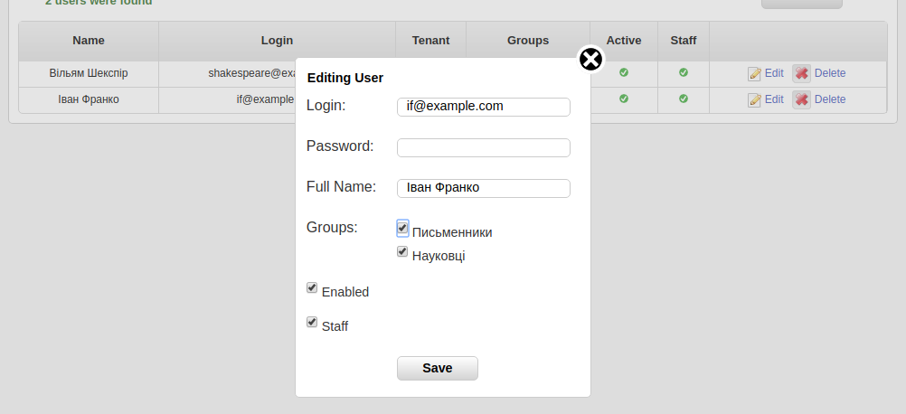

# DubStack

This middleware is used to synchronize Riak CS contents with filesystem.



## What it can do

1. **Simple authentication**

    Login/password and other credentials are stored in Riak CS bucket,
    called "security" and can be manipulated through web interface.

    You don't have to implement complex ``vN`` AWS signing algorithms.

2. **HTTP/2 support**

    Cowboy framework supports HTTP/2 and allows you to serve static files
    in a more efficient way. In order to use HTTP/2, you would need to
    generate SSL certificates and then change [middleware_app.erl](src/middleware_app.erl).
    See [example](https://github.com/ninenines/cowboy/blob/master/examples/ssl_hello_world/src/ssl_hello_world_app.erl).

3. **Readable URLs**
    It transliterates UTF8 object names. For example pseudo-directory
    ``"useful"`` will be encoded as ``"75736566756c/"`` prefix,
    file name ``"корисний.jpg"`` becomes object key ``"korisnii.jpg"``.

4. **Action log**

    It records history of upload, copy, move, rename and delete operations.
    History is stored in ``.riak_action_log.xml`` object by default.

5. **Search**

    It has a simple Solr API implementation, allowing to index contents of uploaded objects.
    Since Yokozuna was removed from Riak CS, you will have to setup Solr and its schema manually.
    See [solr_schema.xml](doc/solr_schema.xml) and [solr_setup.txt](doc/solr_setup.txt).

6. **Thumbnails**

    Thumbnails are generated on demand by dedicated gen_server process.

7. **Provides web interface, Android application and synchronization client for Windows**

    You can manage objects, users, their groups and tenants using browser or Android App.


## Installation

#### 1. Build Riak CS

[See Riak CS Installation Manual](/doc/riak_cs_setup.md) for installation and configuration instructions.

#### 2. Build DubStack

Clone this repository and execute the following commands.
```sh
wget https://erlang.mk/erlang.mk
make fetch-deps
make deps
make
```

In order to use specific version of erlang, you should set environment variables 
*C_INCLUDE_PATH* and *LIBRARY_PATH*. For example:
```sh
export C_INCLUDE_PATH=/path/to/erlang/R1902/usr/include
export LIBRARY_PATH=/path/to/erlang/R1902/usr/include
```

#### 3. Edit configuration files

You need to change ``riak_api_config`` in ``include/riak.hrl``.
Find ``riak-cs.conf`` in Riak CS directory, take ``admin.key`` value from ``riak-cs.conf``
and place it to ``access_key_id`` in ``include/riak.hrl``.

Then find riak.conf in Riak directory and place value of ``riak_control.auth.user.admin.password``
to ``include/riak.hrl``, to the ``secret_access_key`` option.

In order to add first user, authentication should be disabled temporary.

Edit file ``include/riak.hrl`` and set ``ANONYMOUS_USER_CREATION`` to ``true``.

Then start DubStack by executing ``make run``.

#### 4. Add users

Create the first ``tenant``:
```sh
curl -X POST "http://127.0.0.1/riak/admin/tenants/" \
    -H "accept: application/json" \
    -H "Content-Type: application/json" \
    -d "{ \"name\": \"My Brand\", \"enabled\": \"true\", \"groups\": \"Engineers, Another Group\" }"
```

**Expected Response** :
```json
{
   "id":"mybrand",
   "name":"My Brand",
   "enabled":"true",
   "groups":[
      {
         "id":"engineers",
         "name":"Engineers"
      },
      {
         "id":"anothergroup",
         "name":"Another Group"
      }
   ]
}
```

Add the first ``user``:
```sh
curl -X POST "http://127.0.0.1/riak/admin/mybrand/users/" \
    -H "accept: application/json" \
    -H "Content-Type: application/json" \
    -d "{ \"name\": \"Joe Armstrong\", \"login\": \"ja@example.com\", \"password\": \"secret\", \"enabled\": \"true\", \"staff\": \"true\", \"groups\": \"engineers, anothergroup\" }"
```

**Expected Response** :
```json
{
   "id":"1fc069d1c19b47b4454f5673b25b653c",
   "name":"Joe Armstrong",
   "tenant_id":"mybrand",
   "tenant_name":"My Brand",
   "tenant_enabled":"true",
   "login":"ja@example.com",
   "enabled":"true",
   "staff":"true",
   "groups":[
      {
         "id":"engineers",
         "name":"Engineers",
         "available_bytes":-1,
         "bucket_id":"the-mybrand-engineers-res",
         "bucket_suffix":"res"
      },
      {
         "id":"anothergroup",
         "name":"Another Group",
         "available_bytes":-1,
         "bucket_id":"the-mybrand-anothergroup-res",
         "bucket_suffix":"res"
      }
   ]
}
```

Now you can disable ``ANONYMOUS_USER_CREATION``, restart DubStack and login
using credentials of staff user that you have just created.
Staff user has permission to add other users.


## Dependencies

Apart from erlang packages, it depends on the folliwing packages.

* coreutils ( ``"/usr/bin/head"`` command )

* imagemagick-6.q16

* libmagickwand-dev


## API Documentation

[See API reference](API.md)


## Benefits

### 1. Simple Architecture

Erlang applications are much easier to maintain.

Typical setup:



Erlang web application:




### 2. Multi-tenant Setup

DubStack creates buckets with names of the following format.
```
<bucket prefix>-<user id>-<tenant id>-<bucket type>"
```
**bucket prefix** : A short string that can be used by reverse-proxy, such as Nginx:
```
location /the- {
    proxy_pass_header Authorization;
    ...
}
```

**user id** : Short string, that identifies User bucket created for.

**tenant id** : Short identifier of tenant ( aka project ).

**bucket type** : By default "res", -- restricted. Only users within the same tenant
can access restricted buckets. Other suffixes can be "public" or "private", but they
are not yet implemented.


## 3. UI

Action Log



User Management Interface






# Contributing

Please feel free to send me bug reports, possible securrity issues, feature requests or questions.
